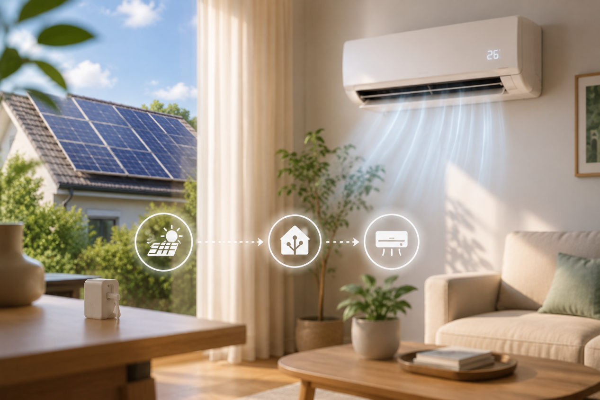
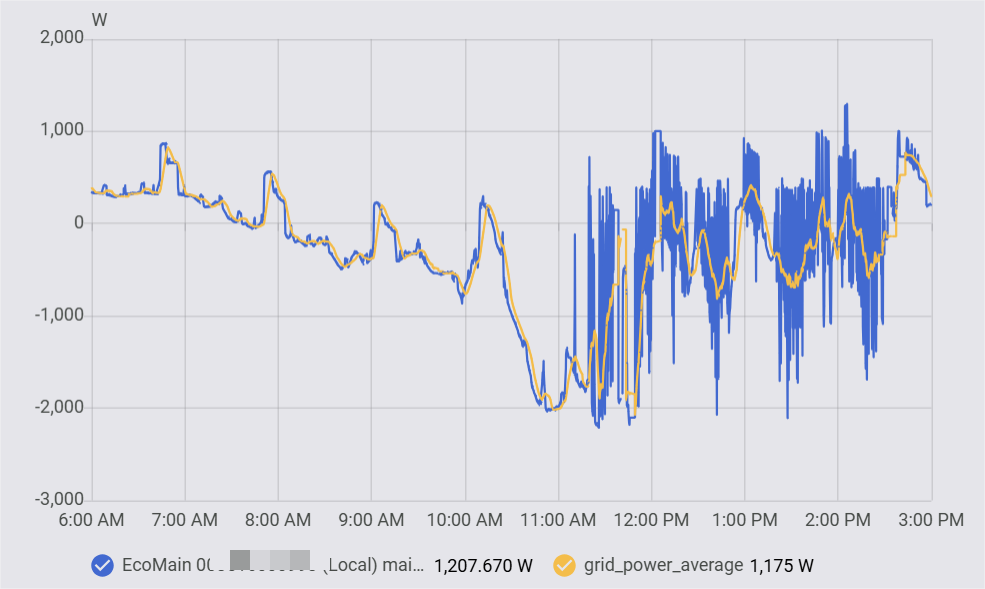
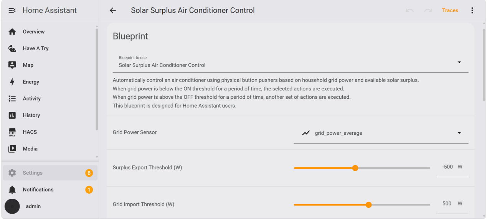

# Using Solar Surplus to Control an Air Conditioner with Home Assistant

## 1. The Idea

I've had rooftop solar for a while, and like many people, I wanted to use as much of my own generation as possible instead of exporting it to the grid. Home Assistant makes automation easy in general, but I quickly realised that deciding when to run an air conditioner wasn't as straightforward as I expected.

I tried fixed schedules, sunset triggers, and even weather forecasts. They all worked to some extent, but none of them actually told me what my solar system was doing at that exact moment. A sunny forecast doesn't mean I have surplus power right now, and a scheduled automation doesn't know whether I'm exporting or already importing from the grid.

What I really wanted was something that reacts to actual energy flow in real time. If there's enough surplus solar, let the air conditioner use it. If the house starts drawing from the grid again, reduce the load automatically.

So I built this Blueprint. It uses a 5-minute average Grid Power sensor from my energy monitor to decide when my air conditioner should run. No schedules or forecasts, just the actual power balance between the house and the grid.

---

## 2. What the Blueprint Does

This Blueprint monitors a 5-minute average Grid Power sensor and performs different actions depending on whether surplus solar is available.

When the configured export threshold is reached and stays stable for a set period, it can:

- Turn the air conditioner on
- Lower the temperature (by pressing the temperature button one or more times)

When the configured import threshold is reached and stays stable, it can:

- Turn the air conditioner off
- Raise the temperature (by pressing the temperature button one or more times)

All thresholds, stability times, button press counts, and button delays are configurable. This makes it easy to adjust the automation for different PV systems and household patterns.

The Power, Temperature Up, and Temperature Down buttons can each be configured independently, so you only need to select the switches you plan to use. If an action is enabled but its required button has not been configured, the automation stops and creates a persistent notification in Home Assistant explaining what is missing.

The Blueprint also lets you configure the delay after pressing the power button and the interval between temperature adjustments, which can be useful for devices that need a little time to complete each physical press.

In my case, I'm using fingerbots to physically press the buttons because my air conditioner doesn't have a native HA integration. The same approach can also work with other air conditioners that can be controlled through physical buttons.

---

## 3. Requirements

Here's what I'm using in my setup:

- Home Assistant
- An energy monitor providing Grid Power data
- A 5-minute average Grid Power sensor created in Home Assistant
- A PV system
- An air conditioner with physical control buttons
- Xiaomi Home Integration installed in HA (via HACS)
- Fingerbot entities visible in HA and can be triggered manually

The fingerbots act as physical button pushers. They press the actual buttons on my AC unit, allowing Home Assistant to control it without a native integration. The Blueprint lets you choose which actions to enable. Some people might only want on/off control, while others, like me, may also want temperature adjustments based on how much surplus is available.

---

## 4. Setup

The setup is fairly straightforward. I'm using a smart control hub as the bridge between the fingerbots and Xiaomi Home, which then exposes them to Home Assistant through the Xiaomi Home integration.

The basic setup:

1. Pair the fingerbots with the smart control hub in the Xiaomi Home app.
2. Install the Xiaomi Home integration in HA via HACS and log in with the same Mi account.
3. Once synced, the fingerbots should appear as switch entities in HA. But in my case, the actual control entities are exposed through the Gateway device, not the fingerbot devices themselves. The Gateway provides one switch entity per fingerbot.
4. Test each one manually from HA to confirm they trigger correctly.

Once that's done, you're ready to build the automation.

---

## 5. Why I Used Averaged Grid Power Instead of PV Power

At first I considered using PV generation directly as the trigger. But solar production alone doesn't tell you whether there is actually enough surplus power available for another load.

For example, my array might be producing 5 kW, while the house is already using 5.5 kW. In that situation, I'm still importing power from the grid. On the other hand, 2 kW of solar generation can be more than enough when the house is only using 1 kW.

Grid Power gives a much better picture of the actual balance between generation and household consumption. A negative value means the house is exporting power, while a positive value means it is importing from the grid.

The problem with using the raw Grid Power value is that it can change quite quickly as appliances switch on and off. To make the automation less sensitive to short fluctuations, I created a 5-minute average Grid Power sensor and use that as the trigger for the Blueprint.

This gives the automation a smoother signal to work with, while still reflecting the actual balance between the house and the grid.

*raw vs averaged Grid Power comparison*

---

## 6. My Current Configuration

Here's what I'm actually running right now. It's been working reliably for me. These are just the values that happened to work well in my setup, not recommended defaults.

The delay settings are mainly there to accommodate physical button pushers. Depending on the device, you may need longer or shorter delays for reliable operation.

| Setting | My Value |
|---------|----------|
| Trigger Sensor | 5-Minute Average Grid Power |
| Surplus Export Threshold | -500 W |
| Grid Import Threshold | 500 W |
| Stability Time | 60 seconds |
| Delay after Power Button | 5 seconds |
| Delay between Temperature Presses | 8 seconds |

**With these settings:**

- When Grid Power stays below -500 W for 60+ seconds → press power button, then press temp-down 3 times.
- When Grid Power stays above 500 W for 60+ seconds → press power button, then press temp-up 3 times.

These work well for my system, but yours will probably be different depending on your PV size and household demand. I'd suggest starting conservative and adjusting from there.

---

## 7. Why I Added a Stability Delay

One thing I noticed during testing: power readings can change quickly.

Clouds pass, appliances cycle on and off, and grid power can cross a threshold for just a few seconds. If the automation reacted immediately, the air conditioner could turn on and off repeatedly.

So the Blueprint waits until the condition has remained true for a configurable amount of time before doing anything.

I settled on 60 seconds for my setup. It's long enough to ignore most short fluctuations while still responding reasonably quickly when the overall power situation changes. You can adjust this value depending on how stable or variable your own power readings are.

---

## 8. Current Limitations

For the most reliable results, I usually let the automation handle the AC. However, because I'm using fingerbots to physically press buttons, Home Assistant has no way of knowing the air conditioner's actual state. If someone uses the remote or presses the buttons manually, Home Assistant won't know that the AC state has changed. This is simply a limitation of using physical button pushers instead of a native integration.

---
## 9. Import this Blueprint

Click the button below to import this blueprint directly into Home Assistant:

Or manually copy and paste this URL:

`https://raw.githubusercontent.com/zzr122/blueprints/refs/heads/main/ac_robots333`

---

I've been using it with my own setup and will keep updating it as I find things worth changing. Feedback and suggestions are welcome.
